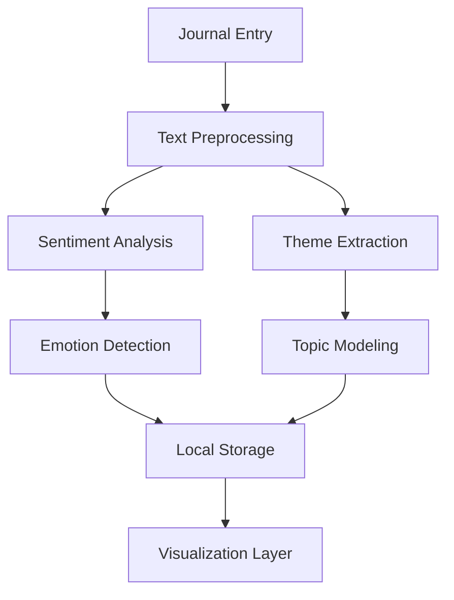

# AI-Powered Features Technical Specification

## 1. Dynamic, Empathetic Prompts

### Data Model
```typescript
interface PromptContext {
  recentEntries: Array<{
    content: string;
    sentiment: number; // -1 to 1
    detectedEmotions: string[];
    timestamp: Date;
  }>;
  userPreferences: {
    promptStyle: 'reflective' | 'directive' | 'exploratory';
    preferredTopics: string[];
    avoidTopics: string[];
  };
  journalingHabits: {
    frequency: 'daily' | 'weekly' | 'irregular';
    averageEntryLength: number;
    timeOfDay: 'morning' | 'afternoon' | 'evening' | 'various';
  };
}
```

### Implementation Phases
1. **Phase 1: Basic Prompt System**
   - Implement template-based prompt generation
   - Add time/date awareness
   - Basic sentiment-based prompt selection

2. **Phase 2: Context-Aware Prompts**
   - Add entry history analysis
   - Implement topic tracking
   - Add emotion detection integration

3. **Phase 3: Adaptive Learning**
   - Add user feedback mechanism
   - Implement prompt effectiveness tracking
   - Personalize prompt style based on user engagement

---

## 2. Private Sentiment & Theme Analysis

### Architecture


### Technical Stack
- **NLP Processing**: TensorFlow.js with pre-trained models
- **Storage**: IndexedDB for local data persistence
- **Visualization**: D3.js for interactive charts
- **Privacy**: All processing happens client-side

### Data Flow
1. Entry submission triggers analysis
2. Text is processed for sentiment and themes
3. Results are stored locally with timestamps
4. UI updates with visualizations

---

## 3. Insightful Reflection Summaries

### Summary Generation Logic
1. **Time-based Analysis**
   - Weekly trends (Mon-Sun)
   - Monthly overview
   - Custom date ranges

2. **Pattern Recognition**
   - Mood correlations with activities
   - Topic frequency analysis
   - Writing style changes

3. **Insight Generation**
   - Positive reinforcement
   - Noteworthy patterns
   - Gentle observations

### Example Output Structure
```json
{
  "period": "2025-09-01 to 2025-09-30",
  "moodSummary": {
    "averageSentiment": 0.72,
    "trend": "improving",
    "highlights": ["Most positive day: Sep 15 (0.89)", "Most active writing time: Evenings"]
  },
  "keyThemes": [
    {"topic": "work", "sentiment": 0.45, "frequency": 12},
    {"topic": "family", "sentiment": 0.82, "frequency": 8}
  ],
  "notableInsights": [
    "You wrote most frequently about work this month, with mixed feelings.",
    "Your entries about family showed consistently positive sentiment.",
    "You mentioned 'morning routine' 5 times, often with positive associations."
  ]
}
```

## Implementation Roadmap

### Week 1-2: Foundation
- Set up TensorFlow.js with basic sentiment analysis
- Create local storage infrastructure
- Design data models and schemas

### Week 3-4: Core Features
- Implement dynamic prompt system
- Build sentiment analysis pipeline
- Create basic visualization components

### Week 5-6: Enhancement
- Add theme extraction
- Implement reflection summaries
- Polish UI/UX

### Week 7-8: Refinement
- Add user preferences
- Implement feedback mechanisms
- Performance optimization

## Privacy & Security
- All processing happens client-side
- No data leaves the device without explicit consent
- Clear data management controls
- Transparent about data usage
